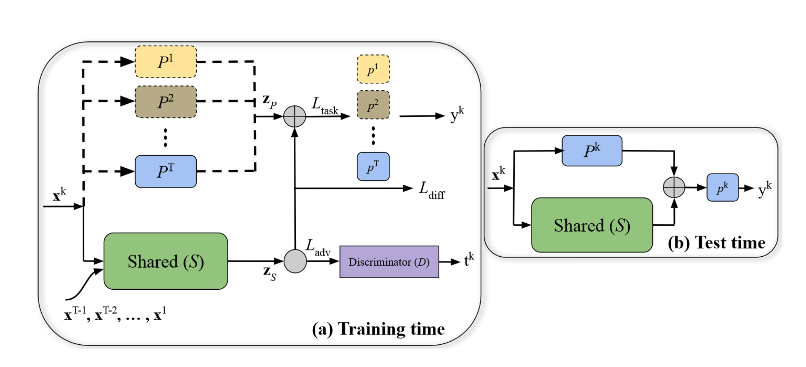
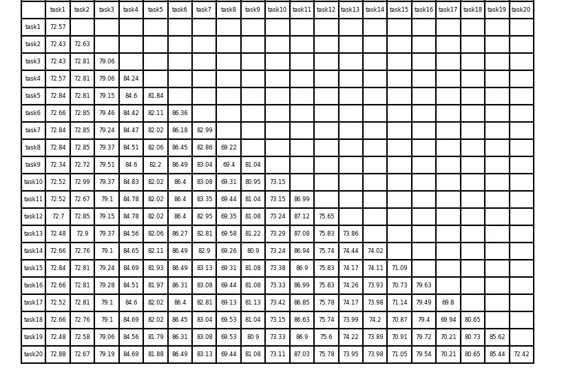

# Adversarial Continual Learning [(ECCV'2020)](https://arxiv.org/abs/2003.09553)

## Abstract

Continual learning aims to learn new tasks without forgetting previously learned ones. We hypothesize that representations learned to solve each task in a sequence have a shared structure while containing some task-specific properties. We show that shared features are significantly less prone to forgetting and propose a novel hybrid continual learning framework that learns a disjoint representation for task-invariant and task-specific features required to solve a sequence of tasks. Our model combines architecture growth to prevent forgetting of task-specific skills and an experience replay approach to preserve shared skills. We demonstrate our hybrid approach is effective in avoiding forgetting and show it is superior to both architecture-based and memory-based approaches on class incrementally learning of a single dataset as well as a sequence of multiple datasets in image classification. Our code is available at https://github.com/facebookresearch/Adversarial-Continual-Learning.



## Citation

```bibtex
@article{ebrahimi2020adversarial,
  title={Adversarial Continual Learning},
  author={Ebrahimi, Sayna and Meier, Franziska and Calandra, Roberto and Darrell, Trevor and Rohrbach, Marcus},
  journal={arXiv preprint arXiv:2003.09553},
  year={2020}
}
```

## How to Reproduce ACL

- **Step1: Set the path in `run_trainer.py` with `./config/acl.yaml`**
    ```python
    config = Config("./config/acl.yaml").get_config_dict()
    ```
- **Step2: Run command**
    ```python
    python run_trainer.py
    ```

## Results on CIFAR-100 dataset

The training process is documented in the file `log.txt`

|   Arch   | Input Size | Batch Size | Buffer Size | Epochs | Task Number | Average ACC |
| :------: | :--------: | :--------: | :---------: | :----: | :---------: | :---------: |
| AlexNet-ACL |   3x32x32    |    64     |    0     |  30   |      20      |    77.73    |

The accuracies for 20 tasks are shown below:

