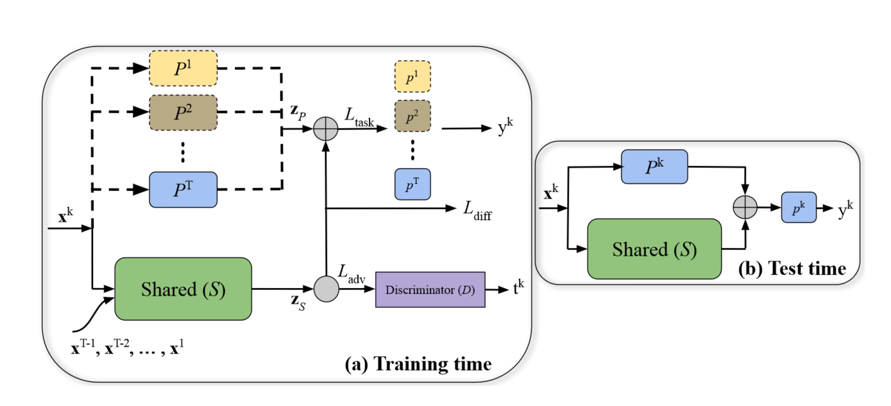

## 目标文件
Files need to be modified:
- [ ] Dataset and Dataloader:
    - [ ] /core/data/dataloader.py
    - [ ] /core/data/dataset.py

- [ ] Training Process:
    - [ ] /core/model/trainer.py

- [ ] Model:
    - [ ] /core/model/acl.py

- [ ] Config File:
    - [ ] /config/acl.yaml

- [ ] REAME.md:
    - [ ] /reproduce/acl/README.md 

## Dataset and Dataloader
需要对数据集和数据记载器进行修改，以适应`ACL`算法的需求。
- [ ] 重写`dataloader.py`中映射方式，使每个任务均为5个类别，且任务中的每个数据的`label`长度为`num_classes=5`。
- [ ] 重写`dataset.py`中的数据集类。
    - [ ] `ContinualDataset` : `create_loader`函数中，将数据集分为多个任务，每个任务包含5个类别。

## Training Process
需要对训练过程进行修改，以适应`ACL`算法的需求。**需要大幅度修改**
- [ ] 重写`trainer.py`中的训练过程。
    - [ ] `__init__` : `optimizer` 和 `scheduler` 需要自己实现。
    - [ ] `train_loop` : 训练过程，需要自己实现。每个`epoch`后手动更新学习率。
    - [ ] `_train` : 每个`epoch`训练。在 `model.observe()` 内部进行参数更新，仅返回损失与准确率。
    - [ ] `_validate` : 重新加载对应 `task_id` 对应模型参数，并进行`Shared` 的替换，再用该模型对该任务进行`inference`。

## Model
`backbone` : `Shared(AlexNet) + Private(AlexNet)` 

`classifier(head)` : `3-layer perceptron` 

`discriminator` : `3-layer perceptron`

`buffer` : 
>    use_memory:"no" -- config_cifar100.yml

**暂时舍弃`backbone`等相关操作**。因为在`ACL`中，`backbone` 中的`Private` 模块对于不同任务需要进行更换，`head` 也需要对于不同任务进行更换，不符合。或者将 `AlexNet` 等作为`backbone` ，然后在`Model`在里面进行组合手动记录`task_id`并设置模块的更换。（`Shared`和`Private`的`AlexNet`结构本身会有差别）

In `acl.py`, we define the model `ACL` as follows:
- [ ] `class Model(nn.Module)`  

    + 记录 `self.task_id` 
	- [ ] `Shared`
	- [ ] `Private`
	- [ ] `head` 
	- [ ] `forward` : 根据`task_id`激活相关模块。
- [ ] `class ACL(Finetune)`
    - [ ] `__init__` : 初始化函数，设置算法所需的初始化参数。
    - [ ] `observe` : 在训练阶段调用，输入一个批次的训练样本并返回预测结果、准确率和前向损失。（在训练阶段面对一个batch的数据，模型如何计算损失，如何进行参数更新）。面对一个batch的数据，需要进行对抗训练。Train Shared Module and Train Discriminator
    - [ ] `inference` : 在推理阶段调用，输入一个批次的测试样本并返回分类结果和准确率。（在测试阶段面对一个batch的数据，模型如何进行前向推理）。经过`Shared` ，`Private` 和 `head` 进行分类。
    - [ ] `forward` : 重写 `PyTorch` 中 `Module` 的 `forward` 函数，返回主干网络的输出。**在提供的方法复现中基本没有在这里实现这个函数**
    - [ ] `before_task` : 在每个任务开始训练之前调用，用于调整模型结构、训练参数等，需要用户自定义。（每个任务训练开始之前的自定义操作）。在这里设置`model.task_id`，在之后`observe`中确保激活正确模块。
    - [ ] `after_task` : 在每个任务开始训练之后调用，用于调整模型结构、缓冲区等，需要用户自定义。（每个任务训练结束之后的的自定义操作）。保存当前任务的模型参数，之后进行`_validate`会用到。
    - [ ] `get_parameters` : 在每个任务开始训练之前调用，返回当前任务的训练参数。

## Config File
[LibContinualDocs](https://libcontinual.readthedocs.io/en/latest/docs/config_file_en.html)

In `acl.yaml`, we set the configuration for the model `ACL` as follows:
- [ ] Dataset：所用数据集
- [ ] Optimizer：训练的优化器与学习率调度器信息
- [ ] Backbone：配置模型骨干网络的信息
- [ ] Buffer：配置数据存储策略
- [ ] Algorithm：与方法相关的参数


- 搞明白 `tt` 是什么  `task module labels`
- acl中 train的流程是什么，总共有几个循环，每个循环有什么作用
```python
for epoch in range(self.config['num_epochs']):
    for each task:
        for epoch in range(self.epochs):
            # train_epoch
            for batch in train_loader:
                # train_batch
        
    # tune the learning rate
    # Valid
    # Adapt lr for S and D
    # Restore best validation model (early-stopping)
                
```


- acl 中dataset是怎么划分的，每个task是怎么划分的。代码里好像看到不同任务的样本混到一起了，这样训练discriminator也许更合理。